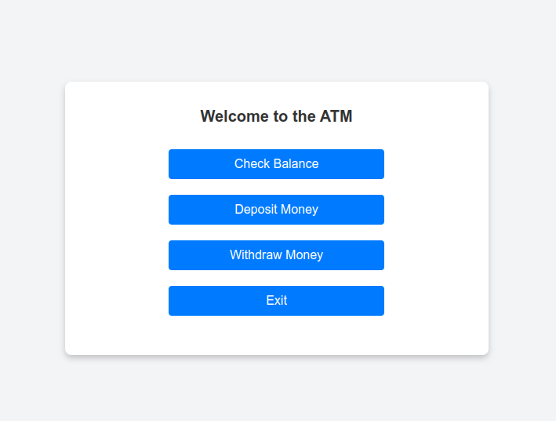

# atm_simulation_web

## Project Description
Create a simplified ATM Simulation program where the user interacts with an ATM-like interface.
The user can perform basic transactions, such as checking their balance, depositing money, and withdrawing money.

Here is how the program works:

* The program starts with a default balance of INR 100.0 and displays option buttons (e.g., check balance, deposit etc)

* The user clicks an option button (e.g., deopist money), follow message box prompt (e.g., enters a deposit amount).

* The program calculates the updated balance and displays.

